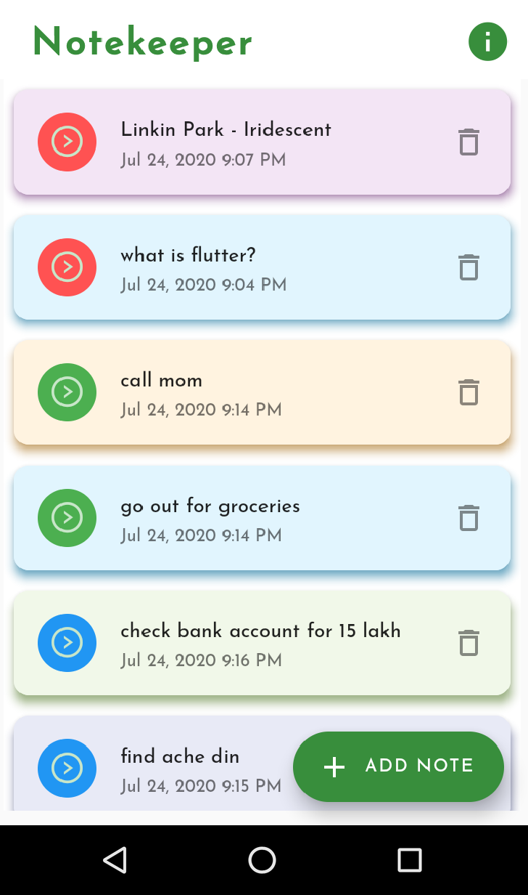
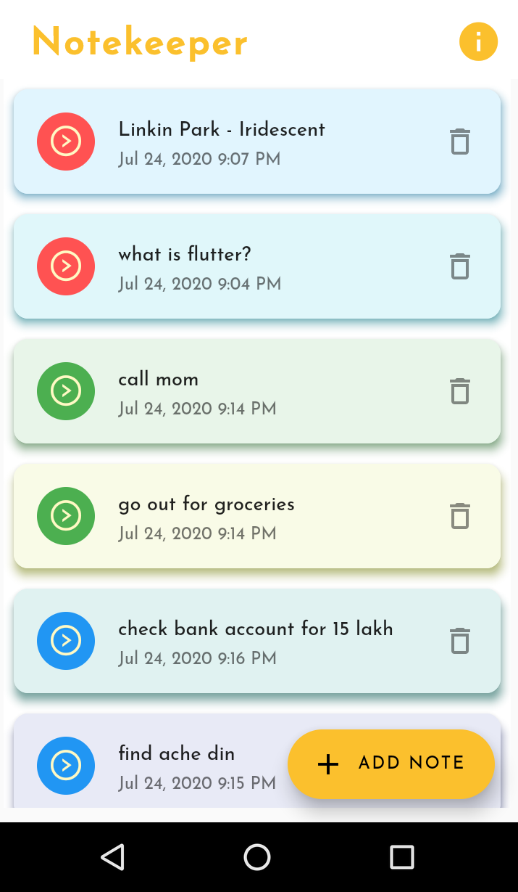
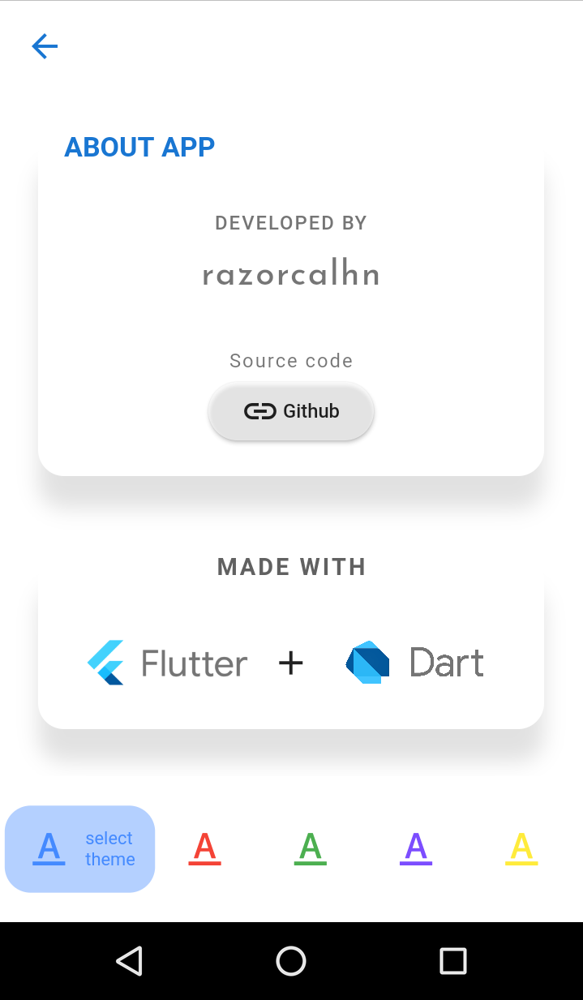
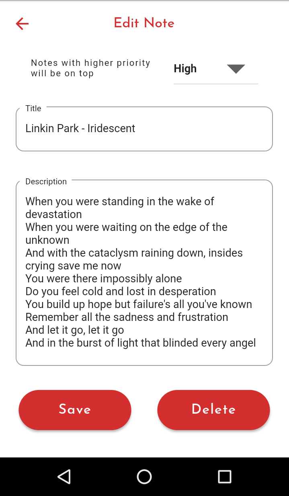

# Notekeeper

A simple Flutter application for keeping notes.

## Features
- *UI*: Note cards with random color tints. 
- *Themes*: Persistent and dynamically changing themes.
- *Sort notes by priority*: Set priority of your notes and they'll be sorted accordingly.
- *View*: View saved notes in a cleaner new window and tap to edit.
- *Edit note*: Edit note that you saved previously, add a description or delete permanently.

## Information
- uses SQLite and path-provider plugins on backend for database and save path selection.
- provider plugin and shared-preferences for dynamic and persistent theming.
- other plugins used:
  intl: ^0.16.1
  url_launcher: ^5.5.0
  ant_icons: ^1.0.0
  expanding_bottom_bar: ^0.1.2

## Run the project
- With Flutter installed, clone project and run `flutter run --release` in that directory, 
or
- Download the built APK from [here](https://github.com/razorcalhn/notekeeper_app/blob/app-beautification/github_assets/notekeeper.apk)

## Screenshots
  

